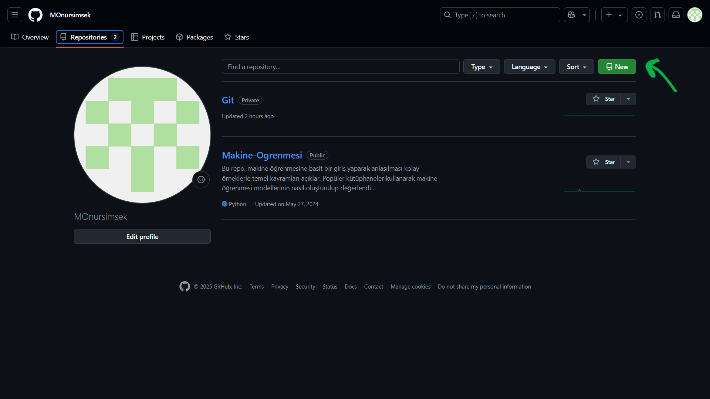

# **GİT VE GİTHUB KULLANIMI**

## 🔹 **GİTHUB NEDİR ?**

GitHub, yazılım geliştiricilerinin kodlarını paylaştığı, işbirliği yaptığı ve projelerini yönettiği bir platformdur. Temelde bir versiyon kontrolü sistemine dayalıdır ve Git adı verilen bir yazılımın üzerinde çalışır. 

GitHub, Git'in internet üzerinden kullanımını sağlayan bir web platformudur. GitHub'da yazılımcılar projelerine, "repository" adı verilen depolar (repo) oluşturur ve bu depoları diğer kullanıcılarla paylaşabilirler.

### **GitHub'ın Amacı ve Kullanım Alanları:**
- **Kod Paylaşımı ve İşbirliği:** GitHub, yazılımcıların kendi kodlarını diğerleriyle paylaşmalarını ve bu kod üzerinde birlikte çalışabilmelerini sağlar. Bu, açık kaynak yazılımlarının geliştirilmesinde yaygın olarak kullanılır.

- **Versiyon Kontrolü:** Yazılımcılar, projelerindeki değişiklikleri takip edebilir, önceki sürümlere dönebilir veya hataları geri alabilirler.

- **Hata Takibi ve İletişim:** GitHub, projelerdeki hataları (bug) takip etmek ve çözmek için araçlar sunar. Kullanıcılar, "issue" başlıkları açarak bu hataları ve yapılacak işleri takip edebilir.

- **Kod İncelemeleri:** Projeler üzerine yapılan değişiklikler ("pull request" olarak adlandırılır) diğer kullanıcılar tarafından incelenebilir ve geri bildirim alınabilir.

- **DevOps ve CI/CD:** GitHub, projelerin otomatik olarak test edilmesini, derlenmesini ve dağıtılmasını sağlamak için CI/CD (Continuous Integration / Continuous Deployment) araçlarıyla entegre edilebilir.

### **GitHub Nasıl Kullanılır ?**
- **Hesap Oluşturma:** GitHub'da bir hesap oluşturmak için [GitHub'ın web sitesine](https://github.com/) gidin ve [Sing up](https://github.com/signup?ref_cta=Sign+up&ref_loc=header+logged+out&ref_page=%2F&source=header-home) bölümünden bir kullanıcı adı, e-posta ve şifreyle kaydolun. Daha sonra kullanıcı adınız ve şifreniz ile hesabınıza giriş yapabilirsiniz.

- **Depo (Repository) Oluşturma:** GitHub hesabınızla giriş yaptıktan sonra, yeni bir proje başlatmak için bir "repository" oluşturabilirsiniz. Repository, projenizin tüm dosyalarını, geçmişini ve sürümlerini içinde barındırır. Repositorynizi Public veya Private olarak oluşturabilirsiniz. 

- **Git Kullanarak Repo’ya Erişim:** Projenizi yerel bilgisayarınızda geliştirebilir ve daha sonra insanlaral veya ekip arkadaşlarınınzla paylaşmak veya projenize verisyonlar eklemek için Git'i kurarak, terminal veya komut satırı üzerinden depoya erişebilirsiniz. 

Github sadece çoğunlukla yazılımcılar tarafından kullanılsada isteyen herkes bir hesap oluşturup kendi dosyalarını insanlarla paylaşabilir veya depolayabilir.

## 🔹 **GİT NEDİR ?**
Git, yazılım geliştirme sürecinde kullanılan popüler bir versiyon kontrol sistemidir. Git, projelerdeki tüm değişiklikleri takip eder, bu sayede ekip üyeleri arasında işbirliği yapılmasını sağlar. Git, dağıtık bir sistem olduğu için her geliştiricinin kendi bilgisayarında tam bir proje kopyası bulunur, bu da güvenliği ve hızı artırır.

### **Git'in Temel Özellikleri**

- **Dağıtık Yapı:** Git, her geliştiricinin kendi bilgisayarında projenin tam bir kopyasını tutmasını sağlar. Yani, internet bağlantısı olmadan da projede çalışılabilir.

- **Hızlı ve Verimli:** Git, verimli bir yapıya sahiptir ve işlemleri çok hızlı gerçekleştirir. Bu, büyük projelerde bile hızlı çalışma anlamına gelir.

- **Versiyon Takibi:** Git, projede yapılan her değişikliği kaydeder ve geliştiricilerin bu değişikliklere dönmesini sağlar.

- **Branch (Dal) ve Merge (Birleştirme):** Git, aynı projede farklı özelliklerin paralel olarak geliştirilebilmesine olanak tanır. Branch kullanarak yeni özellikler üzerinde çalışabilir ve ardından bu değişiklikleri ana koda dahil edebilirsiniz.

- **Geri Alınabilir Değişiklikler:** Git, yapılan değişikliklerin tüm geçmişini kaydeder, bu da geçmişe dönüp eski sürümlere ulaşmayı ve gerekirse bir değişikliği geri almayı kolaylaştırır.

- **Çakışma Çözümü:** Git, aynı dosya üzerinde birden fazla geliştirici farklı değişiklikler yaparsa, bu çakışmaları (conflict) çözmenize yardımcı olacak araçlar sunar.

### **GİT NASIL ÇALIŞIR ?**
Git'in nasıl çalıştığını anlamak için bazı kavramları anlamalıyız.
- **Working Directory (Çalışma Dizinim) :** 
Working Directory, üzerinde aktif olarak çalıştığınız dosyaların bulunduğu yerel dizindir. Burada, projedeki dosyalar üzerinde değişiklik yaparsınız. Git, çalışma dizinindeki dosyaların hangi sürümlerinin takip edileceğini ve hangi dosyaların henüz commit edilmediğini takip eder.

    - Örnek: Projeyi bilgisayarınızda açtığınızda, dosya üzerinde bir değişiklik yaparsınız, örneğin bir Python dosyasının kodunu güncellersiniz. Bu dosya çalışma dizinindedir ve henüz Git'e bildirilmemiştir.

- **Staging Area (Hazırlık Alanı) :**
Çalışma dizinindeki değişiklikleri geçici olarak saklamak ve bir commit yapılmadan önce hangi değişikliklerin kaydedileceğini seçmektir. Bu aşama, bir nevi "bekletme alanı" gibidir.

    - Örnek: git add index.html komutunu yazarsanız, index.html dosyasındaki değişiklik staging area'ya eklenir. Ancak bu değişiklik henüz depoya commit edilmemiştir.

- **Repository (Depo) :**
Repository (veya kısaca Repo), tüm proje geçmişinin, sürümlerinin ve commitlerinin saklandığı Git'in ana deposudur. Repository, hem yerel (bilgisayarınızda) hem de uzak (GitHub gibi platformlarda) olabilir.

    - **Yerel Depo:** Bilgisayarınızda çalışırken, tüm proje geçmişiniz ve versiyonlarınız burada saklanır.
    - **Uzak Depo:** GitHub gibi platformlarda barındırılan, genellikle işbirliği yapılan projelerin tüm dosyalarının ve geçmişinin depolandığı yerdir.

Bu alanlar arasında dosyalarınızı taşıyarak versiyon kontrolü yapabilirsiniz.
Aşağıda bu akışı gösteren bir vektör grafiği ilave edilmiştir
[Grafiğin web sayfası]

### **GİT KURULUMU**
Git'i bilgisayarınıza kurmak için [GİT](https://git-scm.com/) sayfasına giderek cihazınıza uygun dosyayı download kısmından indirerek kurulumu yapabilirisiniz. Kurulum sırasında özelleştirme yapmak istemiyorsanız sadece next tuşuna basın ve kurulumun bitmesini bekleyin. Eğer kurulum sırasında bir sıkıntı oluşmadıysa git diye aratma yaptığınızda Git Bash ve Git GUI uygulamalarını görmeniz gerekir. Git Bash komut satırı kullanarak git işlemleri yapmanızı sağlar Git GUI ise basit bir grafik arayüzü ile işlem yapmanızı sağlar.

### **ÖNEMLİ GİT KOMUTLARI VE İŞLEVLERİ**
Öncelikle Git için bir çok komut vardır biz sadece bir kısmını inceleyecegiz Git'in bütün dökümantasyonuna [buradan](https://git-scm.com/doc) ulaşabilirsiniz.

Git Bash i kullanmaya başladığınızda ilk olark yaptığınız commit işlemlerin sizin kim olduğunuzun bilinmesi için aşagıdaki kodları girmeniz gereklidir. Bu kodalar saysinde yaptığınız değişikliklerde kullanıcı adınız ve email adresiniz gözükür.

`git config --global user.name "Adınız"`

`git config --global user.email "email@example.com"`

---
#### **`git config`**
 Git yapılandırmalarını ayarlamak için kullanılır. Git, kullanıcı bilgilerini (ad, e-posta), tercih edilen düzeni (metin düzenleyici vb.), ve diğer ayarları git config komutuyla yapılandırır. Bu ayarları global (tüm sistemde geçerli) ya da local (sadece mevcut depo için geçerli) olarak yapabilirsiniz. Yapılandırmaları görmek için aşağıdaki kodu kullanabilirsiniz.

`git config --list`

---

#### **`git help`**
Git komutları hakkında yardım almak için kullanılır. git help komutunun ardından, belirli bir Git komutunun detaylı açıklamalarını öğrenebilirsiniz. Bu komut, Git komutlarının nasıl kullanılacağını anlamanızı sağlar.

`git help commit`

Bu komut, git commit komutunun nasıl kullanıldığını açıklayan yardım sayfasını gösterir. Bu sayfada komutun işlevi, parametreleri, ve örnek kullanım gibi bilgiler bulunur.

---

#### **`git init`**
Yeni bir Git deposu başlatmak için kullanılır. Bu komut, bir proje üzerinde sürüm kontrolünü başlatır ve Git tarafından izlenmeye başlanmasını sağlar. git init, mevcut bir dizini Git deposu haline getirir, yani o dizindeki dosyaların değişiklik geçmişi Git tarafından izlenmeye başlanır.

Bu komut, mevcut dizini bir Git deposuna dönüştürür. Git, bu dizinde bir .git adında gizli bir klasör oluşturur. Bu klasör, depo ile ilgili tüm meta verileri ve sürüm geçmişini içerir.

---

#### **`git clone`**
Uzak bir Git reposunu yerel bilgisayarınıza kopyalar. Bu komut, mevcut bir Git deposunun tüm içeriğini ve geçmişini bir kopya olarak bilgisayarınıza indirir. Genellikle, GitHub, GitLab, Bitbucket gibi uzak depolardan projeyi almak için kullanılır.

`git clone <repo_url>`

Burada <repo_url>, uzak depoyu tanımlayan URL'dir. Git, bu URL'deki depo hakkında tüm bilgiyi alır ve yerel bilgisayarınıza bir kopyasını oluşturur.

---

#### **`git add`**
Değişiklikleri geçici alana (staging area) ekler. Bu komut, çalışma dizinindeki değişiklikleri Git'e "hazırlamak" için kullanılır. git add komutuyla, hangi dosyaların commit'lenmesi gerektiğini belirtmiş olursunuz.

`git add <dosya_adı>`

`git add index.html`

Bu komut, index.html dosyasındaki değişiklikleri staging area'ya ekler, yani bu dosya bir sonraki commit için hazırlanır.

---

#### **`git status`**

Çalışma dizini ve staging area'nın durumunu gösterir. Hangi dosyaların değiştirildiğini, hangi dosyaların staging area'ya eklenip eklenmediğini ve hangi dosyaların commit edilmediğini görüntülemenizi sağlar.

---

#### **`git diff`**
Değişikliklerin farklarını gösterir. Bu komut, çalışma dizinindeki değişiklikleri staging area'ya eklemeden önce görmenizi sağlar.

`git diff index.html`

Bu komut, index.html dosyasındaki henüz commit edilmemiş değişikliklerin farklarını gösterir.

---

#### **`git commit`**
Değişiklikleri kalıcı olarak kaydeder. Bu komut, staging area'daki değişiklikleri Git geçmişine kaydeder ve bir commit oluşturur.

`git commit -m "Commit mesajı"`

`git commit -m "Ana sayfa düzenlendi"`

Staging area'daki değişiklikler kalıcı olarak kaydedilir.
Bu komutla birlikte, her commit'e açıklayıcı bir mesaj eklenmesi gerekir, böylece her bir değişiklik ne olduğunu açıklayan bir açıklamaya sahip olur.

---

#### **`git restore`**
Dosyaları çalışma dizinine geri alır. Bu komut, dosyaları önceki bir duruma (commit edilmiş hali veya staging area) geri almanızı sağlar.

`git restore <dosya_adı>`

`git restore index.html`

Bu komut, index.html dosyasını son commit'in içeriği ile geri yükler.

Staging area'dan değişiklikleri geri almak için:

`git restore --staged index.html`

Çalışma dizinindeki değişiklikleri eski haline getirir, yani dosya üzerinde yapılan değişiklikler kaybolur.
--staged parametresi ile staging area'daki dosyalar geri alınır.

---
#### **`git reset`**
Commit'leri geri alır veya staging area'daki değişiklikleri siler. git reset komutu, commit geçmişini değiştirmek veya değişiklikleri staging area'dan kaldırmak için kullanılır.

`git reset <commit_hash>`

`git reset --hard HEAD~1`

Bu komut, son commit'i geri alır ve tüm değişiklikleri (hem staging area'da hem de çalışma dizininde) siler.

--hard parametresi ile commit ve çalışma dizinindeki değişiklikler geri alınır.

--soft parametresi ile yalnızca commit geri alınır, değişiklikler çalışma dizininde kalır.

--mixed parametresi ile commit geri alınır ve değişiklikler staging area'dan çıkarılır.

---

#### **`git rm`**

Dosyayı çalışma dizininden ve Git geçmişinden siler. Bu komut, hem çalışma dizininde hem de depodaki Git geçmişinde dosyaları siler.

`git rm <dosya_adı>`

`git rm index.html`

Bu komut, index.html dosyasını çalışma dizininden ve Git geçmişinden siler.

Sadece staging area'dan silmek için:

`git rm --cached index.html`

 ---
#### **`git mv`**

Dosyayı taşır veya yeniden adlandırır. Bu komut, dosyaları taşımanıza veya adlarını değiştirmenize olanak tanır.

`git mv <eski_dosya_adı> <yeni_dosya_adı>`

`git mv eski_dosya.txt yeni_dosya.txt`

Bu komut, eski_dosya.txt dosyasını yeni_dosya.txt olarak yeniden adlandırır.

---

#### **`git branch`**
Git deposundaki dalları (branch) yönetmek için kullanılır. Bu komutla mevcut dalları listeleyebilir, yeni dallar oluşturabilir veya mevcut dallarla ilgili diğer işlemleri yapabilirsiniz.

`git branch`

Bu komut mevcut dalları listeleyecektir.

`git branch <dal_adı>`

`git branch dal1`

Bu komut, dal1e adında yeni bir dal oluşturur.

`git branch -D dal1`

Bu komut, dal1 dalını siler.

---
#### **`git checkout`**

Mevcut dalda değişiklik yapmadan başka bir dala geçiş yapar veya bir dosyayı geri alır. Bu komut, dal değiştirme işlemlerinin yanı sıra, eski bir commit'ten dosya geri almak için de kullanılabilir.

Bir dalı değiştirmek için:

`git checkout <dal_adı>`

`git checkout dal1`

Bu komut, dal1 dalına geçiş yapar.

`git checkout <commit_hash> <dosya_adı>`

`git checkout abc123 index.html`

Bu komut, index.html dosyasını abc123 commit'inin haline geri getirir.

---

#### **`git merge`**
Bir dalın içeriğini başka bir dala birleştirir. Bu komut, bir dalda yapılan değişiklikleri başka bir dala entegre etmek için kullanılır.

Birleştirme işlemi için:

`git merge <dal_adı>`

`git merge dal1`

Bu komut, dal1 dalındaki değişiklikleri mevcut dalınıza birleştirir (merge eder).

---
#### **`git log`**
Commit geçmişini gösterir. Bu komut, proje üzerindeki commit'lerin geçmişini sıralar ve her commit ile ilgili bilgileri (yazar, tarih, commit mesajı) görüntüler.

Commit geçmişini görmek için:

`git log`

Bu komut commit geçmişinizi sıralı bir şekilde gösterecektir.

`git log --oneline`

Bu komut, commit'leri daha kısa bir şekilde, yalnızca commit hash ve mesajıyla gösterir.

---

#### **`git remote`**
Uzak depolar (remote repositories) ile etkileşime geçmek için kullanılır. Bu komutla uzak depoları yönetebilir, bağlantı bilgilerini listeleyebilir veya uzak depolara yeni dallar ekleyebilirsiniz.

`git remote`

Bu komut, mevcut uzak depoların listesini gösterir.

`git remote -v`
Bu komut, her uzak depo için bağlantı URL'sini de gösterir.

`git remote add origin https://github.com/username/repository.git`

Bu komut, origin adıyla yeni bir uzak depo ekler.

`git remote remove origin`

Bu komut, origin adlı uzak depoyu siler.

`git remote rename origin upstream`

Bu komut, origin uzak deposunu upstream olarak yeniden adlandırır.

---
#### **`git fetch`**
Uzaktaki depodan (remote repository) değişiklikleri yerel depoya (local repository) alır, ancak çalışma dizininizi veya mevcut dalınızı değiştirmez. Bu komut sadece uzak depodaki güncellemeleri indirir, ancak herhangi birleştirme (merge) veya dal geçişi (checkout) işlemi yapmaz.

`git fetch <remote_adı>`

`git fetch origin`

Bu komut, origin adlı uzak depodan son değişiklikleri alır. Ancak, mevcut çalışma dalınızda herhangi bir değişiklik yapmaz.

---
#### **`git push`**
Yerel depodaki değişiklikleri uzak depoya (remote repository) gönderir. Bu komut, yerel olarak yapılan commit'leri uzak depodaki uygun dala aktarır.

`git push <remote_adı> <dal_adı>`

`git push origin master`

Bu komut, yerel master dalındaki değişiklikleri origin uzak deposuna gönderir.

`git push --all <remote_adı>`

Bu komut bütün dalları uzak depoya gönderir.

---

#### **`git pull`**
 Uzak depodaki (remote repository) değişiklikleri yerel depoya (local repository) alır ve otomatik olarak mevcut dalınızla birleştirir. git pull, git fetch komutunun ardından birleştirme işlemi yapar.

`git pull <remote_adı> <dal_adı>`

`git pull origin master`

Bu komut, origin uzak deposundan master dalındaki değişiklikleri alır ve mevcut yerel dalınızla birleştirir.

Tüm uzak dalları güncellemek için: 
`git pull --all`

--- 

Böylece bazı Git komutlarını incelemiş olduk incelediğimiz komutların farklı varyasyonlarına ve çok daha fazla git komutuna Git'in [dökümantasyon](https://git-scm.com/docs) sayfasından ulaşabilirsiniz.

## Git ve GitHub Arasındaki Fark
Son olarak Git ve Github arasındaki tamal farkdanda bahsederek makalamizi noktalayalım 

Git: Dağıtık bir versiyon kontrol sistemidir. Git ile projeler yerel olarak yönetilir.

GitHub: Git kullanarak projeleri barındırabileceğiniz bir platformdur. GitHub, projelerinizi kolayca paylaşmanızı ve başkalarıyla işbirliği yapmanızı sağlar.

[Grafiğin web sayfası]:https://docs.nesi.org.nz/Getting_Started/Cheat_Sheets/Git-Reference_Sheet/
